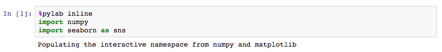

# Introduction

## Goal 1

* **To learn the basic concepts of programming**

We use `Python` for this:

* we need *something* ;)
* free, well-documented, cross-platform
* widely-used

**Use what your colleagues (tend to) use**

## Goal 2

* **To analyse and visualise experimental data**

* Effectiveness of a new treatment for arthritis
* Several patients, recording inflammation on each day
* Tabular (comma-separated) data

**We can do this with a little programming**

* Why programming? **AUTOMATION**

# Setup

## Setting up - 1

Before we begin… 

* **make a neat working environment**
* obtain data

```bash
cd ~/Desktop
mkdir python-novice-inflammation
cd python-novice-inflammation
```

**LIVE DEMO**

## Setting up - 2

Before we begin… 

* make a neat working environment
* **obtain data**

```bash
cp 2017-03-23-standrews/lessons/python-01/data/python-novice-inflammation-data.zip ./
cp 2017-03-23-standrews/lessons/python-01/data/python-novice-inflammation-code.zip ./
unzip python-novice-inflammation-data.zip
unzip python-novice-inflammation-code.zip
```

(you can download files via `Etherpad`)

**LIVE DEMO**

# Getting Started

## Starting `Jupyter`

At the command-line, start `Jupyter` notebook:

```bash
jupyter notebook
```

## `Jupyter` landing page


## Create a new notebook


## My first notebook

* Give your notebook a name (`variables`)


## Cell types

* `Jupyter` documents are comprised of *cells*
* A `Jupyter` cell can have one of several types


* Change the first cell to `Markdown`

## Markdown text

* `Markdown` allows us to enter formatted text.


* Execute a cell with `Shift + Enter`


## Entering code

* Mathematical statements can be entered directly into a code cell


* Execute a cell with `Shift + Enter`


##  Exercise (5min)

* Try out some of your own calculations in code cells, e.g.


## My first variable


* Let's create a variable called `name`, containing `"Samia"`

## Printing a variable


* The `print()` *function* shows the contents of a variable


## Working with variables

```python
weight_kg = 55
print(weight_kg)
2.2 * weight_kg
print("weight in pounds", 2.2 * weight_kg)
weight_kg = 57.5
print("weight in kilograms is now:", weight_kg)
weight_lb = 2.2 * weight_kg
print('weight in kilograms:', weight_kg, 'and in pounds:', weight_lb)
weight_kg = 100
print('weight in kilograms:', weight_kg, 'and in pounds:', weight_lb)
```

* **LIVE DEMO**

## Who's who in memory?

* **If you are in a `Jupyter` notebook or `iPython` terminal…**
* `%whos` will show you all defined variables


# Data Analysis

## Start a new notebook


* Add a header

## Examine the data

* `data/inflammation-01.csv`

```bash
$ head data/inflammation-01.csv 
0,0,1,3,1,2,4,7,8,3,3,3,10,5,7,4,7,7,12,18,6,13,11,11,7,7,4,6,8,8,4,4,5,7,3,4,2,3,0,0
0,1,2,1,2,1,3,2,2,6,10,11,5,9,4,4,7,16,8,6,18,4,12,5,12,7,11,5,11,3,3,5,4,4,5,5,1,1,0,1
0,1,1,3,3,2,6,2,5,9,5,7,4,5,4,15,5,11,9,10,19,14,12,17,7,12,11,7,4,2,10,5,4,2,2,3,2,2,1,1
0,0,2,0,4,2,2,1,6,7,10,7,9,13,8,8,15,10,10,7,17,4,4,7,6,15,6,4,9,11,3,5,6,3,3,4,2,3,2,1
0,1,1,3,3,1,3,5,2,4,4,7,6,5,3,10,8,10,6,17,9,14,9,7,13,9,12,6,7,7,9,6,3,2,2,4,2,0,1,1
0,0,1,2,2,4,2,1,6,4,7,6,6,9,9,15,4,16,18,12,12,5,18,9,5,3,10,3,12,7,8,4,7,3,5,4,4,3,2,1
0,0,2,2,4,2,2,5,5,8,6,5,11,9,4,13,5,12,10,6,9,17,15,8,9,3,13,7,8,2,8,8,4,2,3,5,4,1,1,1
0,0,1,2,3,1,2,3,5,3,7,8,8,5,10,9,15,11,18,19,20,8,5,13,15,10,6,10,6,7,4,9,3,5,2,5,3,2,2,1
0,0,0,3,1,5,6,5,5,8,2,4,11,12,10,11,9,10,17,11,6,16,12,6,8,14,6,13,10,11,4,6,4,7,6,3,2,1,0,0
0,1,1,2,1,3,5,3,5,8,6,8,12,5,13,6,13,8,16,8,18,15,16,14,12,7,3,8,9,11,2,5,4,5,1,4,1,2,0,0
```

* Plain text, comma-separated
* To load it, use `numpy` library

## `Python` libraries

* `Python` contains many powerful, general tools
* Specialised tools are contained in *libraries*
* We call on libraries, when needed
* Libraries are loaded with `import`

```python
import numpy
import seaborn
```

## `JUPYTER` MAGIC

* Another way to get use of some libraries in `Jupyter` is through *magic*

```python
%pylab inline
import numpy
import seaborn
```

* **This only works in `Jupyter` notebooks**



## `numpy`, `seaborn`, `pylab`

* `numpy`: work with matrices and arrays in `Python`
* `seaborn`: attractive statistical summary graphs
* `pylab`: numerical operations and visualisation in `Python`

* Calling `%pylab inline` shows graphics within the notebook itself

## Load data

* `numpy` provides a function `loadtxt()` to load tabular data:

```python
numpy.loadtxt(fname='data/inflammation-01.csv', delimiter=',')
```
* *dotted notation* tells us `loadtxt()` belongs to `numpy`
* `fname`: an *argument* expecting the path to a file
* `delimiter`: an *argument* expecting the character that separates columns

## Loaded data


* The matrix is truncated to fit the screen
* `...` indicate missing rows or columns
* If there are no significant digits, they are not shown (`1 == 1. == 1.0`)
* **Assign the matrix to a variable called `data`**

## What is our data?

```python
type(data)
print(data.dtype)
print(data.shape)
```

**LIVE DEMO**

## Members and attributes

* Creating the array created information, too
* Info stored in *members* or *attributes* that belong to `data`
* `data.<attribute>` e.g. `data.shape`

## Indexing arrays


* Counting of array elements **starts at zero**, not at one.

```python
print('first value in data:', data[0, 0])
print('middle value in data:', data[30, 20])
```

**LIVE DEMO**

## Slicing arrays


* Define *start* and *end* separated by `:` (colon).

```python
print(data[0:4, 0:10])
print(data[5:10, 0:10])
```

**LIVE DEMO**

## More slices, please!

* Don't specify *start*, `Python` assumes the first element
* Don't specify *end*, `Python` assumes the end element

**QUESTION:** What would `:` on its own indicate?

```python
small = data[:3, 36:]
print('small is:')
print(small)
```

**LIVE DEMO**

## Array operations

* `array`s know how to perform operations on their values
* `+`, `-`, `*`, `/`, etc. are *elementwise*

```python
doubledata = data * 2.0
print('original:')
print(data[:3, 36:])
print('doubledata:')
print(doubledata[:3, 36:])
tripledata = doubledata + data
print('tripledata:')
print(tripledata[:3, 36:])
```

**LIVE DEMO**